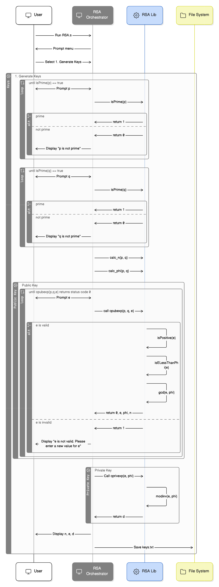
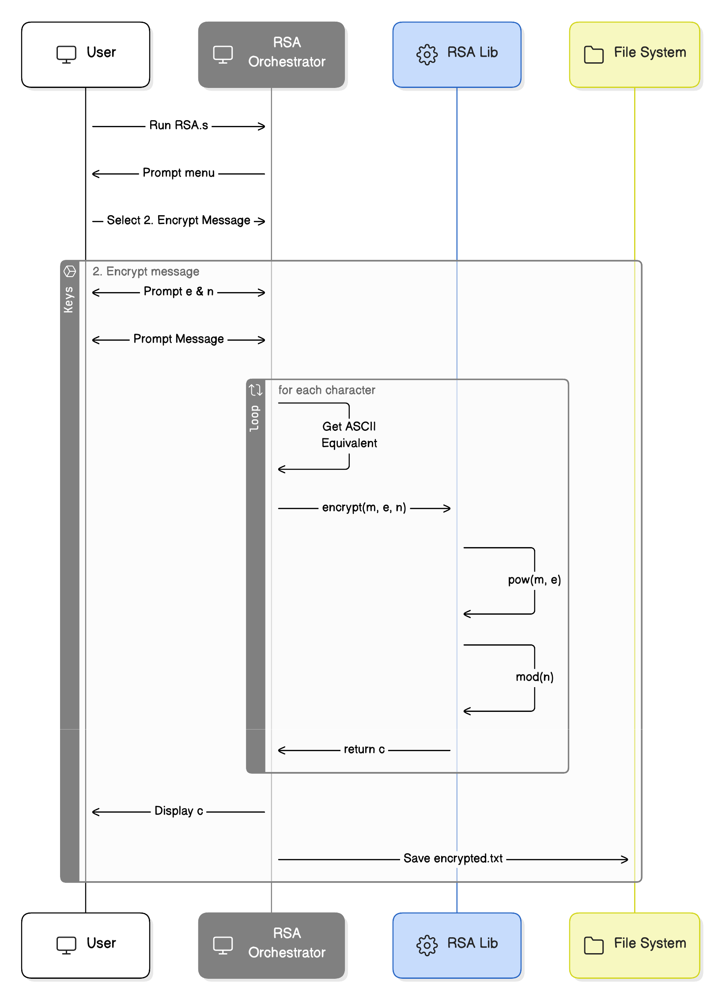
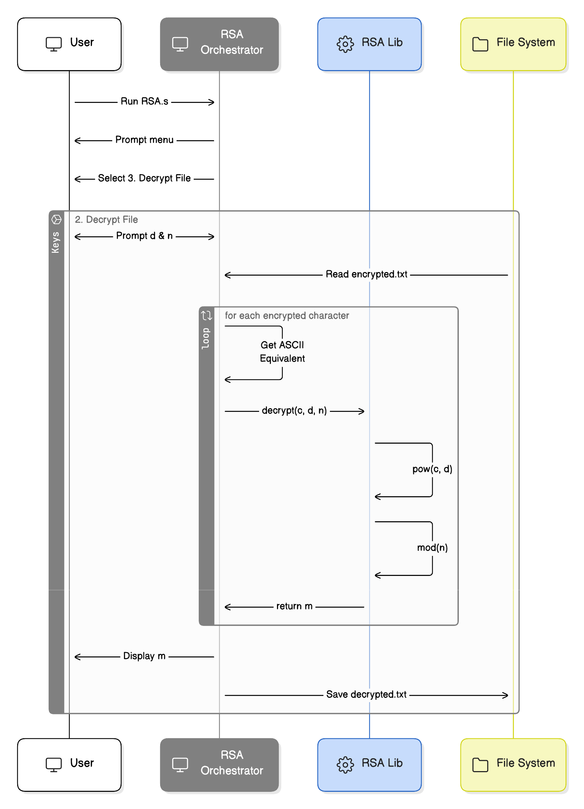
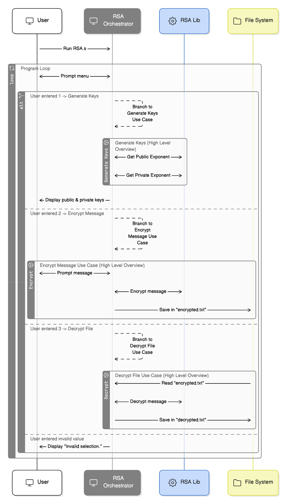

# Course Project: ARM Programming RSA Algorithm - Design Document

Course: EN.605.204.81.SP26
Date Created: 2026-02-06
Last Update: 2026-02-06

Team Members:

- Sandra Banaszak
- Elizabeth Fuller
- Savlatjon Khuseynov
- James Ritter
- Kangjie Mi
- Dana Zhang

## Overview & Context (Savlatjon)

This design document describes the architecture, module breakdown, function specifications, data flow, and implementation plan for a team-developed ARM Assembly program that implements the RSA (Rivest-Shamir-Adleman) public-key cryptographic algorithm. The document serves as a collaborative blueprint to guide implementation and ensure all team members share a unified understanding before coding.

RSA is an asymmetric cryptography system used to generate a public and private key pair for encryption and decryption. This key pair has multiple uses, including digital signatures and symmetric key exchanges. Generating a key pair begins with selecting two distinct, large prime numbers, p and q. For this example, we are going to use small prime numbers p = 11 and q = 13. From these numbers, we can generate a modulus n = p _ q = 143 by taking the product of the two chosen prime numbers. Next, we take the lowest common multiple (LCM) of p - 1 and q - 1. Here, LCM(10, 12) = 60. We will call this function λ(n)(lambda(n)). We then choose an integer e strictly greater than 2 and strictly less than λ(n) (so, 2 < e < λ(n)). The greatest common divisor of e and λ(n) must be equal to 1, meaning e and λ(n) are coprime. In this case, our encryption exponent is e = 7. From this, we can calculate the decryption exponent d such that d = 1 _ mod(λ(n)). Hence, d = 43. Now we have a public key formed from the modulus n and the encryption exponent e, and a private key formed from the modulus n and the decryption exponent d. Everything calculated should remain a secret except for n and e, which form the public key. Now, a third party can encrypt some plaintext with our public key, and we can decrypt it using our private key.

## Scope & Responsibilities (James)

### In Scope

- The program will prompt the user to enter values for `p`, `q`, and `e`, generate the public and private keys, and display them to the user.
- The program will prompt the user to enter a message, encrypt it, and save it in the file called `encrypted.txt`.
- The program will open the file called `encrypted.txt`, decrypt it, and save it in the file called `decrypted.txt`.

### Out of Scope

- The program will not accept `p` and `q` values larger than 50.
- The program will not generate `e`. It will prompt the user to enter this value.
- The program will not allow the user to read the encrypted file from a custom path.
- The program will not allow the user to save the decrypted file at a custom path.

### Responsibilities

This program will have the following responsibilities:

1. Display a menu prompting the user to:
   a. Generate public/private keys.
   b. Encrypt a message.
   c. Decrypt a file.

   Menu System:
```
---- RSA Encryption Program ----
1. Generate Public and Private Keys
2. Encrypt a Message
3. Decrypt a Message
4. Exit

Enter a choice (1-4):
```
3. Generate Private and Public Keys
   a. Prompt the user to enter values for `p`, `q`, and `e`.
   b. Check if `p` and `q` are prime.
   c. Calculate `n = p * q`
   d. Calculate `phi = (p - 1) * (q - 1)`
   e. Validate that `e` is a positive integer, $1 < e < phi$, and `e` is coprime to `phi` through the function called `cpubexp`
   f. Calculate the private key `d` such that $d = (1 + x * phi) / e$.
4. Encrypt a message
   a. Prompt the user to enter a message.
   b. Encrypt each character in sequence via the `encrypt` function.
   c. Save the encrypted message in a file called `encrypted.txt`.
5. Decrypt a message
   a. Open the file called `encrypted.txt`.
   b. Decrypt each character in sequence using the `decrypt` function.
   c. Save the decrypted message in a file called `decrypted.txt`.

## Goals & Milestones

### Goals (James)

- Goal 1: Deliver a working RSA encoder/decoder in ARM32 assembly that meets all project requirements listed above.
- Goal 2: Maintain a clean separation of concerns between the main program (user interaction, program flow, filesystem) and the RSALib.s library (encryption/decryption math routines).
- Goal 3: Ensure correctness and readability through incremental testing at each major feature milestone.
- Goal 4: Validate robustness by testing with another group’s implementation and handling invalid inputs gracefully.

## Proposed Solution & Use Cases (Elizabeth)
The proposed solution intends to enable a secure and successful message exchange using RSA encryption. As RSA is a public-key encryption, the proposed solution is broken into 3 parts that work in concert provide the unified method for secure message exchange:  (1) generating public and private keys, (2) encryption of a message using a public key, and (3) decryption of a message using a private key.

The program will first prompt user input for the desired use case. All use cases are called from the main program, in which matching a valid input value from the user triggers the call. 

Valid inputs are positive integers `1`, `2`, and `3` that map to the use case. For example, a user input `3` will trigger the Use Case 3, Decrypt Message call to execute.

### Use Case 1: Generating Public and Private Keys
The following process diagram outlines input handling, dataflow, and output for the public and private key generation:



A corresponding procedural outline is as follows:

1. The user will first be prompted for two positive prime integers, `p` and `q`. Each number will be validated as prime via the function `isPrime()`, and either proceeds to call `cpubexp()` for public key computation on valid input or prompt the user for input until the input is valid.

2. The user is then prompted for the public key exponent value `e`, which is validated to fit the following criteria in `isValid_e()`in a future call.
    - `e` is a positive integer
    - `e` is small, 1 < e  < $\phi$(n) = (p - 1)(q - 1)
    - `e` is coprime to $\phi$(n). This is determined by validating that the greatest common divisor between `e` and $\phi$ is 1, or `gcd(e, phi) = 1`

3. The first half of the public key, `n`, with `calc_n()` is determined with inputs `p` and `q`.
4. The Euler totient, referred to as $\phi$(n) with the label `phi` is computed from inputs `p` and `q` in the function call `calc_phi()`
5. The function `is_Valid_e()` validates input `e` using `phi`. A invalid input value of `e` will prompt the user for input again.
    - a. this function verifies that `e` is as positive integer
    - b. this function verifies that 1 < e  < $\phi$(n) = (p - 1)(q - 1)
    - c. this function calls `gcd()` to verify that the greatest common divisor for `e` and `phi` is 1
7. With values for `p`, `q`, and `e`, the program calls `cprivexp()` to compute the private key, `d`:
    - a. The function call `modinv()` calculates the modular inverse `d` such that $de \equiv 1 \pmod{\phi}$
8. The user's key components are saved to a file on disk, called `keys.txt`, in a format in which the decryption process is expecting:
    - first half of public key, `n` on line 1
    - second half of public key, `e` on line 2
    - private key, `d` on line 3
9. The user's public key components, `n` and `e` are presented as stdout to the user for sharing with a trusted sender. The private key, `d`, is also presented to the user along with `n` and `e`, but is not meant for sharing.

### Use Case 2: Encrypting a Message (Kangjie Mi)
The following process diagram outlines input handling, dataflow, and output for message encryption.
**TODO** get ASCII equivalent by doing conversion? a lookup table?


1. The user will first be prompted for decrypted plaintext character of message.

2. Then program will prompt for integer `e` and `n` as public key factors used for encryption process. `n` was calucalted from public key generation function calc_n() and e was user input in private key generation step that passed validation 

3. The Equation c = m^e mod n is generate cipher text c from given m (plaintext character), e (public key exponent) and n (modulus). The program then loop each individual character of plaintext input, applying the equation to find each encypted characters and hence full excrypted text.

4. Lastly the program writed encrypted message to file named "encrypted.txt" 


### Use Case 3: Decrypting a Message
The following process diagram outlines input handling, dataflow, and output for message decryption.


1. The user selects the "Decrypt a Message" option from the main menu.
2. The program first validates that keys are available by checking memory for valid values of `n` and `d`, either loaded from `keys.txt` or passed in as parameters. If no valid keys are found, the user is prompted to generate keys first and is then returned to the main menu.
3. The program attempts to open `encrypted.txt` in read mode.
   -  If the file does not exist or the file descriptor returned is negative, an error message is displayed and the user is returned to the main menu.
   -  If the file exists but is empty, a separate error message is displayed and the file descriptor is closed cleanly before returning to the main menu.
4. The full contents of `encrypted.txt` are read into an input buffer. The file is then closed. The buffer is expected to contain space-delimited integer tokens, each one representing one encrypted character value `c`.
5. The program opens `plaintext.txt` for writing. If the file cannot be created or opened, an error message is displayed, all file descriptors are closed, and the user is returned to the main menu.
6. The program enters a loop, processing each space-delimited integer token from the input buffer one at a time:
    - a. For each encrypted token `c`, the program performs validation before decryption. The token must be:
        - a valid numeric integer value
        - non-negative
        - less than `n`
        - If a token fails validation, the program displayes an error message, stops the decryption process, closes all file descriptors, and returns the user to the main menu.
    - b. The function `decrypt()` is called with inputs `c`, `d`, and `n`, which internally call `pow_mod(c, d, n)` to compute the plaintext numeric value `m = c^d mod n`.
    - c. The resulting numeric value `m` is interpreted as an ASCII character and is written to the `plaintext.txt` output buffer.
7. After all tokens are processed, `plaintext.txt` is closed. 
8. The decrypted plaintext message is displayed to the user via stdout:
   ```
   Decryption message:
   <plaintext message>
   ```
    The user confirms if the decryption was successful. A distorted/garbage output can indicate that the keys used for decryption do not match the keys used for encryption. 
9. The user is returned to the main menu.

    
## Technical Architecture

The RSA.s program will run in a loop that prompts the user to (1) generate public/private keys, (2) encrypt a message, or (3) decrypt a file. Based on the user’s selection (1, 2, or 3), the program will branch to the appropriate use case and then return to the main menu upon completion. The diagram below provides a high-level overview of the program loop, branching logic, and available use cases. See the Proposed Solution & Use Cases section for a more detailed view of each use case.


## Proposed Solution & Use Cases (Elizabeth)

### TODO: Add detailed function definitions here (All team members)

$calc_n(p, q)$
Inputs:
-  p, a positive integer p < 50
-  q, a positive integeer q < 50

Outputs: 
- n, the product of p anq, p*q

$calc_phi(p, q)$
Inputs:
-  p, a positive integer p < 50
-  q, a positive integeer q < 50

Outputs: 
- phi, the Euler totient, (p - 1) * (q - 1)


$gcd(e, phi)$
Inputs:
-  e, a positive integer
-  phi, the Euler totient

Outputs: 
- m, the greatest common divisor


$isValid_e(e, phi)$
Inputs:
-  e, a positive integer
-  phi, the Euler totient, (p - 1) * (q - 1)

Outputs: 
- 0 if the result from gcd() is not 1, and 1 if the result from gcd() is 1

Calls: 
- gcd()


$cpubexp(p, q, e)$
Inputs:
-  p, a positive integer p < 50
-  q, a positive integeer q < 50
-  e, a positive integer

Outputs: 
- n, the product of p anq, p*q or the first half of the public key
- e, a positive integer or the second half of the public key

Calls:
- calc_n()
- calc_phi()
- isValid_e()
- 
$decrypt(c, d, n)$
Inputs:
-  c, the cipher text or encrypted character
-  d, the private sender key
- n, a portion of the public sender key

Outputs: 
- m, the decrypted character

Calls: 
- pow()
- mod()

$encrypt(m, e, n)$
Inputs:
-  m, the character to encrypt
-  e, a portion of the public sender key
- n, a portion of the public sender key

Outputs: 
- c, the encrypted character or ciphertext

Calls: 
- pow()
- mod()


  
## Testing (Savlatjon)

Testing Strategy
The proposed testing plan - we will test our application on three different levels: unit testing for individual functions of the RSA library, orchestration/UI validation for input validation, and finally end-to-end testing for file handling and flow of the algorithm. We have also considered the ARM architecture for our system; thus, we will carry out our validation directly on the Mystic Beast server.

Our phases for testing will be as follows:

1. Unit Validation - This involves validating individual functions such as isPrime(), gcd(), pow(), etc.
2. Orchestration/UI Validation - This involves validating our main program to ensure it is prompting the user appropriately, validating input appropriately (e.g., input values for prime numbers must be less than or equal to 50), etc.
3. End-to-End (Integration) Testing - This involves validating our main program to ensure it can successfully encrypt a message entered by the user, save it appropriately to a file named encrypted.txt, read it back appropriately, decrypt it, and save it to a file named plaintext.txt.

Examples:

Unit tests

- isPrime(11, 13) -> True.
- isPrime(9, 1) -> False.
- gcd(7, 120) -> 1.

UI/Input tests

- p or q > 50 -> Prompts user to re-enter the value.

End-to-End tests

- Encryption Enter a string "Hello from TEAM x" -> Converts characters to ASCII, encrypts each separately, and writes to "encrypted.txt".

## Open Questions

## Timeline (Elizabeth)

`Start Date: Feb 16, 2026`

`Milestone 1 - Software Design Doc:  Mar 1, 2026`

`Milestone 2, Components of Use Case 1 - Validate p and q with isPrime(), calc_n(), calc_phi(), gcd(), isValid_e(), modinv(), save to file:  Mar 15, 2026`

`Milestone 3, Components of Use Cases 2 and 3 - prompt for user input, read from file, pow(), mod(), numeric to ascii conversion:  Mar 15, 2026`

`Milestone 4, Modular implementation of Use cases 1/2/3 without looping - prompt for user for use case, proceeed to call use case modules that fail on invalid input: Apr 5, 2026`

`Milestone 5 - Implement looping and codify functional testing: Apr 12, 2026`

`Milestone 6 - Bonus Opportunity for message exchange with another group: April 15, 2026`

`End Date: May 3, 2026`

## Sources

Source material used for developing the proposed solution is cited below:

1. [Brilliant: RSA Encryption](https://brilliant.org/wiki/rsa-encryption/)
## Team Roles & Responsibilities

- Sandra Banaszak - Encrypt/Decrypt
- Elizabeth Fuller - Generate Public (RSA Lib gcd(), calc_n(), calc_phi(), cpubexp())
- Savlatjon Khuseynov - Testing (RSA Lib isPrime(), pow(), mod())
- James Ritter - Generate Private Keys (RSA Lib cprivexp(), modinv()), I/O
- Kangjie Mi - CLI/program branching logic
- Dana Zhang - Encrypt/Decrypt
